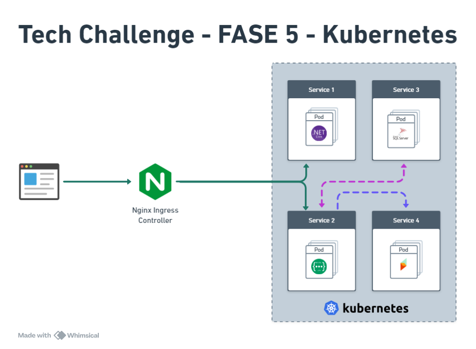

[](https://github.com/fiap-2nett/tc-fase5-kubernetes/actions/workflows/dotnet.yml)

# Cluster Kubernetes

Com o objetivo de manter o foco na criação de configuração de um cluster Kubernetes para prover e orquestrar a solução desenvolvida, reutilizamos o projeto desenvolvido no Tech Challenge 4.

Caso queira verificar o projeto entregue na fase anterior, vide link abaixo:

- [Tech Challenge 4](https://github.com/fiap-2nett/tc-fase4-clean-architecture)

O projeto atualizado no Tech Challenge 4 é altamente baseado em Clean Architecture (Arquitetura Limpa), ou seja,
projetado com foco na separação de preocupações e na dependência de direção única, o que significa que as partes
mais internas do sistema não conhecem as partes mais externas.

Além disso o projeto mantém uma abordagem focada na modelagem de domínios "Domain-Driven Design" (DDD) conforme visto durante o Tech Challenge 1,
ou seja, busca alinhar o desenvolvimento da solução com o domínio do problema, resultando em sistemas mais flexíveis,
compreensíveis e que melhor atendem às necessidades do negócio.

## Documentação de Requisitos

A documentação detalhada de Requisitos Funcionais (RF) e Não Funcionais (RNF) pode ser encontrada na Wiki oficial do projeto.
Além disso, temos capturas de telas do Portal HelpDesk (UI) em funcionamento.

[Wiki Oficial HelpDesk API](https://github.com/fiap-2nett/tc-fase4-clean-architecture/wiki)


## Colaboradores

- [Ailton Alves de Araujo](https://www.linkedin.com/in/ailton-araujo-b4ba0520/) - RM350781
- [Bruno Fecchio Salgado](https://www.linkedin.com/in/bfecchio/) - RM350780
- [Cecília Gonçalves Wlinger](https://www.linkedin.com/in/cec%C3%ADlia-wlinger-6a5459100/) - RM351312
- [Cesar Julio Spaziante](https://www.linkedin.com/in/cesar-spaziante/) - RM351311
- [Paulo Felipe do Nascimento de Sousa](https://www.linkedin.com/in/paulo-felipe06/) - RM351707

## Tecnologias Utilizadas

- .NET 7.0
- Razor
- Entity Framework Core 7.0
- FluentValidation 11.7
- FluentAssertions 6.12
- NetArchTest 1.3
- XUnit 2.4
- Serilog 7.0
- SqlServer 2019
- Seq
- Docker 24.0.5
- Docker Compose 2.20
- Kind 0.23.0
- kubectl 1.30.0

## Arquitetura do cluster

A solução foi arquitetada da seguinte maneira:



Optamos por utilizar o ambiente local para criação e configuração do nosso cluster Kubernetes, para prover as funcionalidades de um cluster
local utilizamos o Kind.

Uma vez tendo os pré-requisitos instalados no host, iremos criar uma novo cluster kubernetes, esse cluster será reponsável por orquestrar
os containers da nossa aplicação (HelpDesk.Api e HelpDesk.Mvc), também serão orquestrados os containers relacionados a infraestrutura do
solução, sendo eles: SQL Server 2019 e Seq.

Para centralizar um único ponto de comunicação externo, e realizar os redirecionamentos optamos por utilizar o NGINX Ingress Controller.

## Como configurar e executar o cluster local

A seguir será descrito todo o processo de instalação e configuração do cluster local passo a passo, após todo este processo ao final será descrito como podemos acessar os serviços providos pelo nosso cluster local.

## Passo 1: Instalar Dependências

Primeiro, você precisa instalar as ferramentas necessárias:

- Docker
- Kind
- kubectl

Após a instalação, verifique as versões das ferramentas mencionadas utilizando os comandos:

```bash
docker --version
```
```bash
kind --version
```
```bash
kubectl version
```

## Passo 2: Criar o Cluster Kubernetes com Kind

Após as ferramentas instaladas, iremos criar nosso cluster no KIND para provisionamento dos serviços e componentes necessários para a execução do nosso projeto.

O comando a seguir utiliza a CLI do KIND para criar um novo cluster com o nome `k8s-helpdesk` utilizando como parâmetro de configuração o arquivo de manifesto `kind-config.yaml`.

Este arquivo contém as parametrizações básicas para dos nodes do tipo:
- control-plane
- worker

Execute o comando a seguir para criar no novo cluster:

```bash
kind create cluster --config k8s/kind-config.yaml --name k8s-helpdesk
```

## Passo 3: Instalar o Ingress Nginx

Um vez configurado o nosso cluster, precisamos configurar o serviço de Ingress Controller para nosso cluster, este serviço nos possibilitará ter um único ponto de acesso aos nossos container em execução sem a necessidades de configurarmos o redirecionamento de portas `port-forward` para cada um de nossos pods.

Existem diversas opções de serviços de Ingress Controller para Kubernetes, para nosso caso de uso optamos por utilizar o Ingress Nginx.

1. Aplicar os recursos YAML do Ingress Nginx: Vamos aplicar os arquivos YAML diretamente para instalar o Ingress Nginx.

```bash
kubectl apply -f https://raw.githubusercontent.com/kubernetes/ingress-nginx/main/deploy/static/provider/kind/deploy.yaml
```

2. Verificar se o Ingress Nginx está em execução:

```bash
kubectl get pods -n ingress-nginx
```

Verifique se os pods do Ingress Nginx estão em execução:

```bash
kubectl get pods -n ingress-nginx
```

## Passo 4: Configurar o Deploy dos Serviços

Após a criação do cluster e configuração do serviço de Ingress, podemos configurar/criar os componentes necessários para o deploy e orquestração do nosso projeto.

Para isso, utilizaremos novamente a CLI `kubectl` para aplicar nossas configurações utilizando como base o arquivo de manifesto `deployment.yaml`.

Este arquivo contém diversas configurações pertinentes ao nosso deploy, estas poderiam estar em arquivos separados, mas com o intuito de facilitar a gestão e centralizar o processo de deploy todas as configurações estão presentes neste arquivo.

As configurações contidas nesse arquivo estão separadas em blocos, cada bloco agrupa as configurações necessárias de cada componente, sendo eles:

1. **pfx-secret.yaml**
    > Cria o secret no k8s para armazenar o certificado SSL utilizado para criptografia de tokens JWT.
2. **tls-secret.yaml**
    > Cria o secret no k8s utilizado pelo Ingress nas configurações de TLS/HTTPS.
3. **helpdesk-db-deployment.yaml**
    > Configura o deploy do container de banco de dados SQL.
4. **helpdesk-log.yaml**
    > Configura o deploy do container do SEQ para ingestão de logs de aplicação.
5. **helpdesk-api-deployment.yaml**
    > Configura o deploy do container da HelpDesk.Api.
6. **helpdesk-web-deployment.yaml**
    > Configura o deploy do container da HelpDesk.Web.
7. **helpdesk-ingress-http.yaml**
    > Configura o serviço de Ingress para as requisições HTTP.
8. **helpdesk-ingress-https.yaml**
    > Configura o serviço de Ingress para as requisições HTTPS.

Execute o comando a seguir para aplicar todas as configurações mencionadas acima:

```bash
kubectl apply -f k8s/deployment.yaml
```

Para monitorar o processamento do deployment e provisionamentos dos services e pods, execute o comando:

```bash
watch 'kubectl get pod,svc,deployment,ingress -A'
```

## Passo 5: Acessando o Serviços

Como estamos executando nosso projeto em um cluster K8S local, não será atribuído dinâmicamente um DNS para acesso público.

Para conseguirmos acessar o nosso ponto de entrada sem a necessidade de ficar obtendo IPs, redirecionamento de portas ou inclusão de DNS nos hosts do nosso sistema, optamos um serviço público `nip.io` que automaticamente resolverá nossa requisição para nosso localhost.

Para acessar os serviços configurados no cluster utilize as seguintes URLs:

- HelpDesk.Logs: http://logs.helpdesk.127.0.0.1.nip.io
- HelpDesk.Web: https://app.helpdesk.127.0.0.1.nip.io
- HelpDesk.Api: https://api.helpdesk.127.0.0.1.nip.io/swagger
